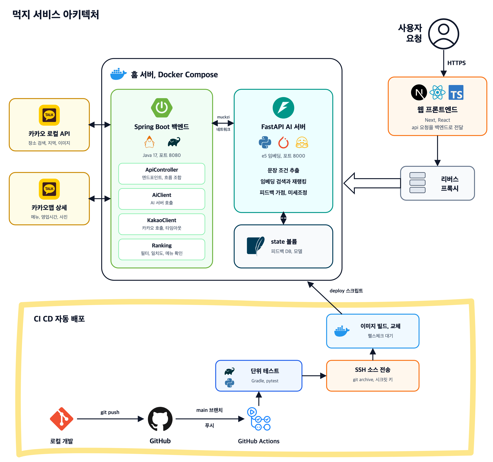
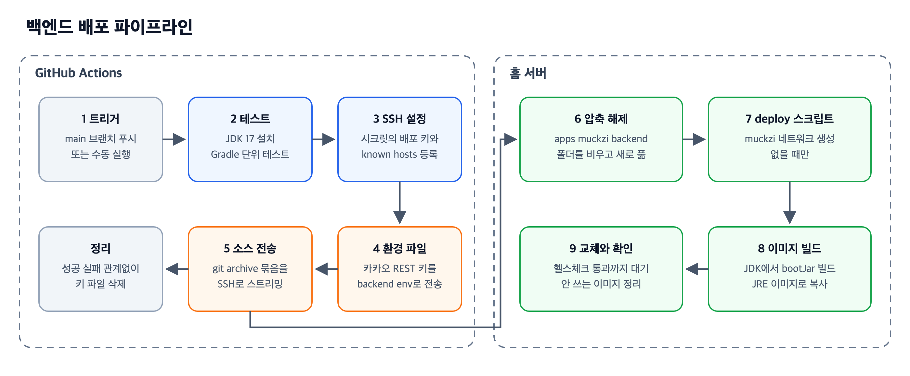

# 먹지 백엔드

먹지 서비스의 중계 서버로, 웹 화면과 AI 추천 서버와 카카오 API 사이를 잇는다

AI 서버가 고른 메뉴를 카카오 로컬 검색으로 주변 음식점 목록으로 바꾸고, 가게가 그 메뉴를 실제로 파는지 메뉴판에서 확인한 뒤 순위를 매겨 돌려준다

별도 데이터베이스 없이 동작하며 의존성은 Spring Boot 웹 모듈 하나뿐이다

## 설계 구조도



## 기술 구성

| 구분 | 내용 |
|---|---|
| 언어 | Java 17 |
| 프레임워크 | Spring Boot 4, Web MVC |
| HTTP 호출 | Spring RestClient |
| 테스트 | JUnit 5 |
| 빌드 | Gradle |
| 배포 | Docker, Docker Compose, GitHub Actions |

## 클래스 구성

| 클래스 | 역할 |
|---|---|
| ApiController | 엔드포인트 정의, 추천 요청 흐름 조합, 입력 길이와 반경 제한 |
| AiClient | AI 서버의 태그 추출, 메뉴 추천, 피드백 저장 호출 |
| KakaoClient | 카카오 로컬 키워드 검색, 좌표 행정동 변환, 이미지 검색, 카카오맵 가게 상세 조회 |
| Ranking | 음식 계열 필터, 일치도 계산, 중복 가게 제거, 메뉴 판매 확인, 최종 정렬 |

외부 응답은 필요한 필드만 가진 record로 받아 모르는 필드는 무시하므로 응답 구조에 필드가 추가되어도 깨지지 않는다

## 엔드포인트

```
GET   /api/health      헬스체크
POST  /api/tags        문장을 AI 서버로 보내 맛, 메뉴, 상황 태그를 받음
GET   /api/recommend   질의, 위도, 경도, 반경으로 추천 음식점 최대 12곳
POST  /api/feedback    좋아요, 별로예요, 골랐어요 반응을 AI 서버로 전달
GET   /api/search      위치 설정 화면의 장소 검색
GET   /api/region      좌표를 행정동 이름으로 변환
```

- 입력 문장은 앞뒤 공백을 자르고 200자까지만 사용한다
- 반경은 100미터에서 3000미터 사이로 고정한다

## 추천 처리 흐름

- AI 서버에 질의를 보내 추천 메뉴 5개와 메뉴 점수를 받는다
- 메뉴마다 카카오 키워드 검색으로 반경 안의 음식점을 최대 15곳 찾는다
- 음식 계열이 맞지 않는 가게를 빼고 일치도를 계산해 상위 30곳을 고른다
- 가게마다 카카오맵 상세에서 메뉴, 영업시간, 사진을 읽어 추천 메뉴를 파는지 확인한다
- 메뉴를 확인한 가게를 앞에 두고 일치도와 거리 순으로 정렬해 12곳을 남긴다
- 사진이 없는 가게만 가게 이름과 구 이름으로 이미지를 검색해 채운다

카카오 호출 수가 메뉴 수와 가게 수의 곱만큼 늘어나므로 2단계, 4단계, 6단계는 병렬 스트림으로 동시에 보낸다

## 핵심 로직

### 음식 계열 필터

카카오 키워드 검색은 느슨해서 국밥을 검색하면 중식당도 섞여 나온다

AI 서버가 알려 준 메뉴 계열과 가게 카테고리의 두 번째 단계가 모두 한식, 중식, 일식, 양식 중 하나인데 서로 다르면 그 가게를 뺀다

술집처럼 계열을 알 수 없는 가게는 남긴다

### 일치도

메뉴 적합도를 주 기준으로, 거리를 보조 기준으로 쓴다

$$
\text{match}(r) = 100 \times \left( 0.8 \times \frac{s(m_r)}{\max_m s(m)} + 0.2 \times \left( 1 - \frac{\min(d_r, R)}{R} \right) \right)
$$

- $s(m_r)$ 는 가게 $r$ 을 찾게 한 메뉴의 AI 추천 점수
- $d_r$ 는 가게까지의 거리, $R$ 은 검색 반경
- 한 가게가 여러 메뉴 검색에 걸리면 일치도가 가장 높은 메뉴 하나만 남긴다

### 메뉴 판매 확인

공개 API에는 가게 메뉴가 없어서 카카오맵 웹이 쓰는 가게 상세 API를 읽는다

- 공백을 지우고 비교하므로 소고기 국밥은 소고기국밥과 맞는다
- 두 글자 이상인 마지막 어절만 맞아도 인정하므로 굴 국밥은 순대국밥과도 맞는다
- 라면사리, 치즈 추가처럼 사리나 추가가 붙은 곁들임 메뉴는 인정하지 않는다
- 메뉴 목록이 있는데 추천 메뉴가 없으면 후보에서 뺀다
- 메뉴 목록 자체가 없으면 확인하지 못한 상태로 남겨 뒤쪽에 배치한다
- 대표 메뉴는 추천 메뉴를 맨 앞에 두고 최대 4개까지 보여 주며 가격이 0 이하면 가격 없음으로 처리한다

### 최종 정렬

메뉴를 확인한 가게, 일치도 높은 순, 거리 가까운 순의 세 단계로 정렬한다

### 장애 허용

- 카카오 호출은 연결 3초, 읽기 5초 타임아웃을 둔다
- 가게 상세와 이미지 검색은 실패하면 빈 값을 돌려 해당 정보 없이 추천을 계속한다
- 가게 상세 API는 비공개라 구조가 바뀌거나 막혀도 메뉴 확인만 빠지고 추천은 동작한다
- 이미지 검색은 가로 300, 세로 200 미만인 블로그 이모티콘류 이미지와 쇼핑 이미지를 거른다
- 원본 이미지 주소가 보안 연결이 아니면 썸네일 주소를 써서 혼합 콘텐츠 문제를 막는다

## 테스트

Ranking 클래스는 외부 호출이 없는 정적 함수로만 이루어져 있어 가짜 가게 데이터만으로 검증한다

- 일치도와 거리 순 정렬, 중복 가게 제거
- 다른 계열 가게 제외
- 메뉴 이름 매칭 규칙
- 메뉴 확인 후 정렬 순서

## 실행 방법

로컬에서는 AI 서버가 18091 포트에서 떠 있어야 한다

```bash
export KAKAO_REST_KEY=발급받은_키
./gradlew bootRun
./gradlew test
```

```
KAKAO_REST_KEY   카카오 REST API 키, 기본값 없음
AI_URL           AI 서버 주소, 기본값 http://localhost:18091
```

## 배포



main 브랜치에 푸시하면 GitHub Actions가 테스트부터 홈 서버 교체까지 자동으로 진행한다

### 배포 단계

- main 브랜치 푸시나 수동 실행으로 워크플로가 시작된다
- Ubuntu 러너에 JDK 17을 설치하고 Gradle 캐시를 복원한 뒤 단위 테스트를 돌린다
- 저장소 시크릿의 배포용 SSH 키와 known hosts를 러너에 등록한다
- 카카오 REST 키를 SSH로 보내 서버의 backend env 파일에 쓰며, 파일 권한은 소유자만 읽도록 제한한다
- git archive로 커밋된 소스만 묶어 SSH로 스트리밍한다
- 서버는 apps 아래 muckzi 폴더에서 기존 backend 폴더를 지우고 새 소스를 푼다
- deploy 스크립트가 muckzi 도커 네트워크를 없을 때만 만든다
- Docker Compose가 이미지를 새로 빌드하고 컨테이너를 교체한다
- 헬스체크를 통과할 때까지 최대 300초 기다리고, 쓰지 않는 이미지를 정리한다
- 성공과 실패에 관계없이 러너의 SSH 키 파일을 삭제한다

같은 워크플로가 동시에 두 번 돌지 않도록 동시 실행 그룹을 두고, 진행 중인 배포는 취소하지 않는다

### 저장소 설정값

```
secrets.DEPLOY_SSH_KEY       서버 접속용 개인 키
secrets.DEPLOY_KNOWN_HOSTS   서버 호스트 키
secrets.KAKAO_REST_KEY       카카오 API 키
vars.DEPLOY_HOST             서버 주소
vars.DEPLOY_PORT             SSH 포트, 기본 2222
vars.DEPLOY_USER             접속 계정
```

### 이미지 빌드

- 1단계에서 JDK 17 이미지로 bootJar를 빌드하며 Gradle 캐시를 빌드 캐시로 마운트해 재빌드 시간을 줄인다
- 2단계에서 JRE 17 이미지에 jar 파일만 복사해 실행 이미지 크기를 줄인다
- 빌드 결과물과 Gradle 캐시는 도커 빌드 컨텍스트에서 제외한다

### 컨테이너 설정

| 항목 | 값 |
|---|---|
| 컨테이너 이름 | muckzi backend |
| 포트 | 호스트 로컬 18090 포트를 컨테이너 8080 포트에 연결 |
| 네트워크 | 외부 도커 네트워크 muckzi |
| AI 서버 주소 | 같은 네트워크의 muckzi ai 컨테이너 8000 포트 |
| 메모리 제한 | 1GB |
| 시간대 | 서울 |
| 재시작 정책 | 직접 멈추기 전까지 항상 재시작 |
| 로그 | 10MB 파일 3개까지 순환 보관 |

- 포트를 로컬 주소에만 열어 외부에서는 앞단 리버스 프록시를 거쳐서만 접근할 수 있다
- 헬스체크는 bash의 TCP 연결로 8080 포트가 열렸는지만 확인하므로 curl 없이 JRE 이미지 그대로 쓴다
- 헬스체크는 5초 간격으로 최대 30번 시도하고 처음 20초는 기동 시간으로 둔다
- AI 서버도 같은 방식으로 배포되며 같은 muckzi 네트워크에 붙어 컨테이너 이름으로 서로를 찾는다
